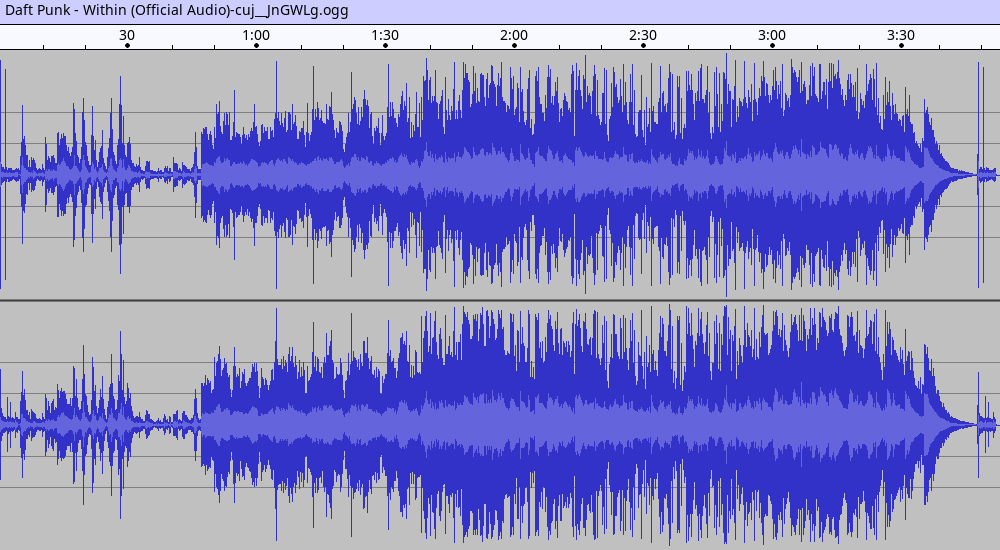
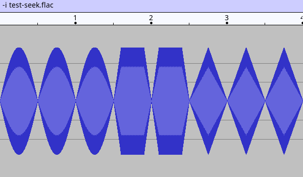
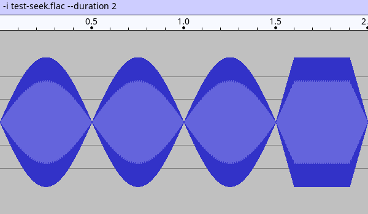
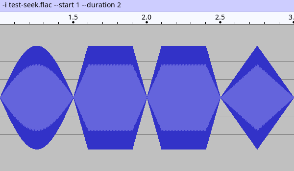
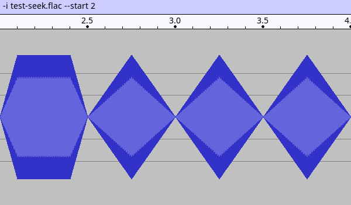
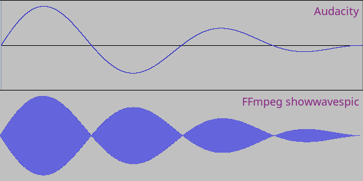
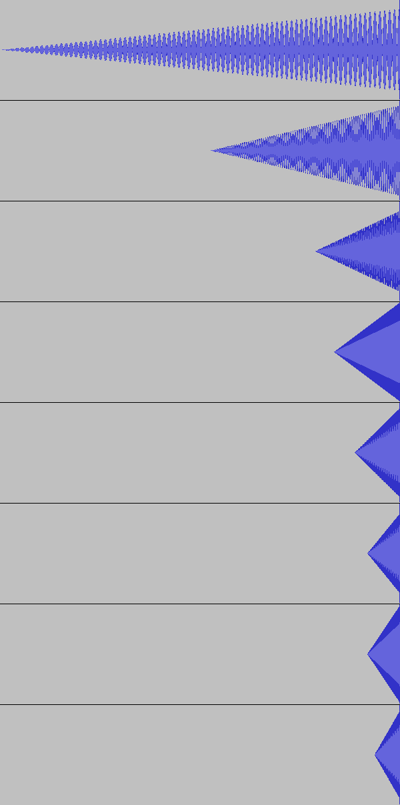

**Table of Contents**

<div id="user-content-toc">

* [Intro](#intro)
* [Usage](#usage)
* [Examples](#examples)
  * [start and duration](#start-and-duration)
* [Known issues](#known-issues)
  * [cline mode](#cline-mode)
  * [inaccurate time bar when the duration is short](#inaccurate-time-bar-when-the-duration-is-short)

</div>

# Intro

The script uses FFmpeg (its showwavespic filter) and ImageMagick to generate a
waveform image similar in look to what Audacity is showing.

# Usage

```
]$ plot_waveform -h
Usage:
  plot_waveform -i FILE [optional arguments]

  Required:
    -i | --input FILE       - input audio file

  Optional:
    -o | --output FILE      - output file (default is same as input with the
                              extensions changed to "png")
    -F | --force            - force overwrite output file

    -t | --title TITLE      - title (default is "artist / album / title" or
                              the filename if metadata is not available)
    -s | --size SIZE        - size (default is 1000x500)

    -S | --start SECONDS    - start position in seconds with fractions
                              (default: 0)
    -d | --duration SECONDS - duration in seconds with fractions
                              (default: input file duration)

    -h | --help             - this help message

The script uses FFmpeg and ImageMagick to crate a waveform image looking similar
to Audacity view.

FFmpeg >= 4.4 is required for the script to work correctly.
```

# Examples

[Daft Punk - Within](https://www.youtube.com/watch?v=cuj__JnGWLg)


## start and duration









# Known issues

## cline mode

showwavespic filter in FFmpeg is using "cline" mode for drawing the samples.
This creates surprising results with low frequency signals or with high zoom:



## inaccurate time bar when the duration is short

showwavespic doesn't always render the full length of the signal when the
duration is short. The time bar is generated independently and it always ends at
full length. When such waveform and time bar are put next to each other, it
looks like the time bar is inaccurate.

Below is 50ms fade-in signal padded with different amounts of silence at the
front. The waveform should always end at full scale but it doesn't always do.



